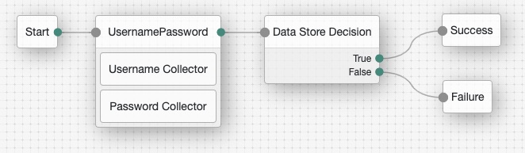

# Authentication Trees

Trees are central to adding intelligent authentication to your application with the ForgeRock Identity Platform and JavaScript SDK.

## Setup

To simplify configuration of your ForgeRock AM environment, the trees used by the samples can be imported using [AM-treetool](https://github.com/jaredjensen/AM-treetool).

```bash
# General usage
./amtree.sh \
  -h <am_host> \
  -u <am_user> \
  -p <am_password> \
  -i <tree_name> \
  -f <path_to_this_repo>/trees/<tree_name>.json

# Example to import the BasicLogin tree
./amtree.sh -h https://default.iam.example.com/am \
  -u amadmin -p password -i BasicLogin \
  -f ~/repos/javascript-sdk-samples/trees/BasicLogin.json
```

## Trees

The trees used in the samples are described in the following sections.

### Basic Login

The most simple authentication flow, this tree captures and validates a user's username and password.



### 2FA

Coming soon

### WebAuthn

Coming soon
